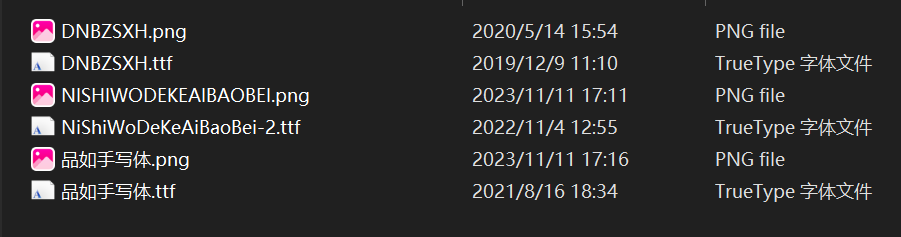
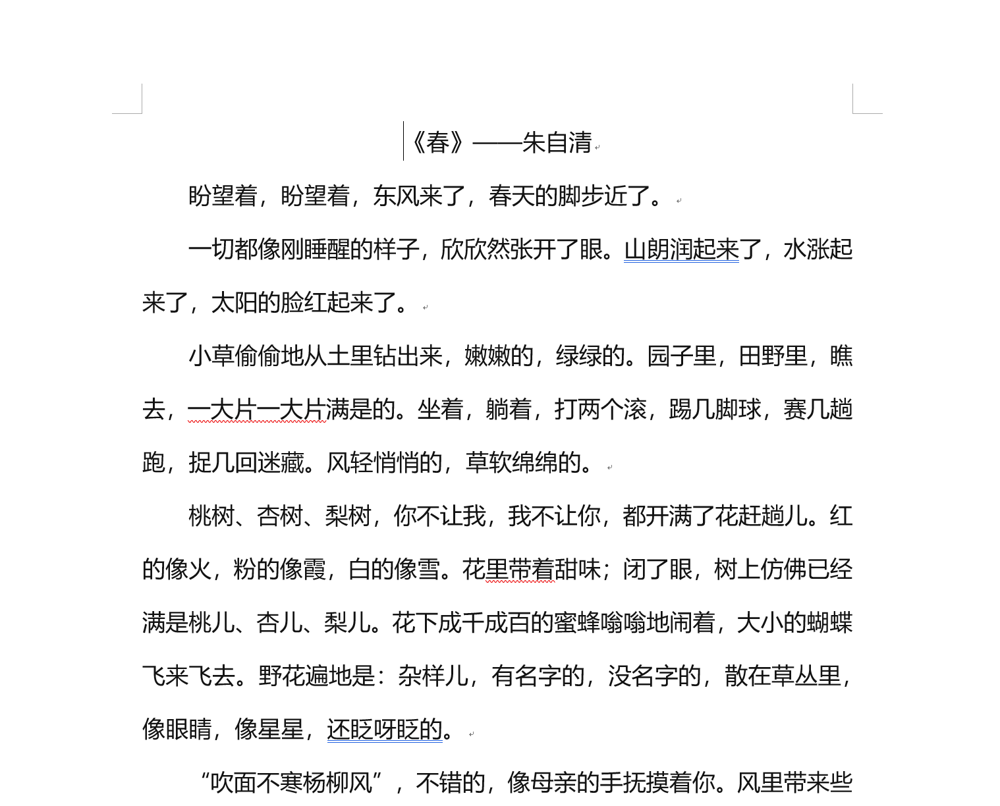
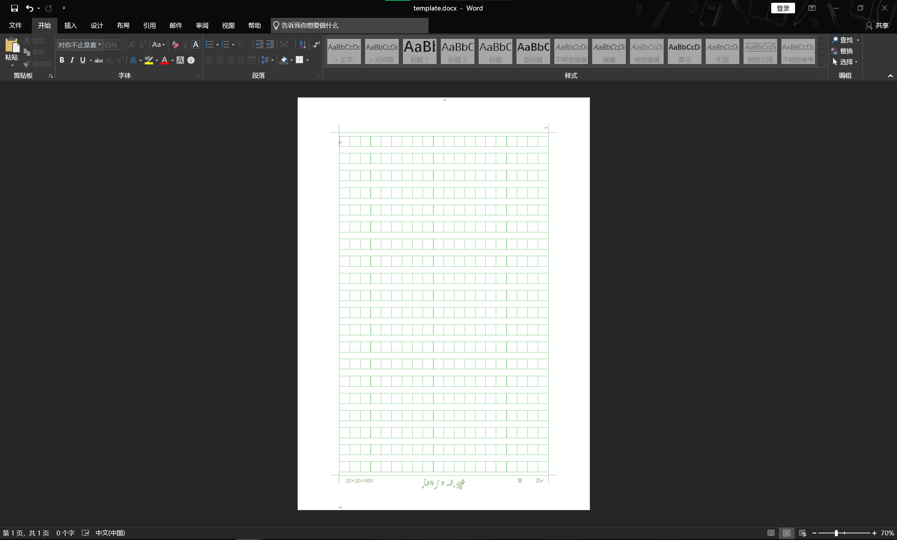
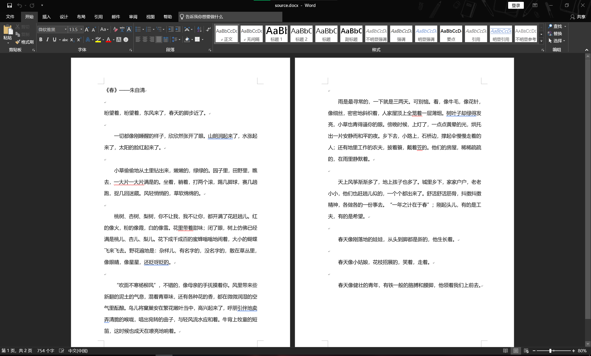

## Chinese Handwriting Tool V2.0

### 简介

随着当今社会电子化程度越来越高，我们难免会懒得自己**手动书写**一份年终感想、检讨书等等，那我们能不能有一个工具可以帮助我们自动化生成手写体文档，从而方便我们打印后上交呢？

这就是这个工具的初衷，它的特点有：

1. python自动化生成，无需手动调整word格式
2. 用户可自定义字体、字体大小范围、每个字上下左右的offset、粗体概率、斜体概率
3. 用户可自定义纸张模板（本示例采用了ZJU稿纸）

### 环境要求

1. Windows、Mac、Linux（新增mac和linux支持！）
2. python 3.3+

### 使用指南

#### 导入字体

首先我们需要找到自己想要的手写体，可以自己去网上搜索，下载下来，或者是使用一些流行的工具生成自己的手写体风格文件。

我在项目目录~/fonts/中放了三种字体，以及它们的预览图也在里面

导入方法为，把你下载下来的风格文件直接双击打开即可，里面会有一个选项是安装`install`

然后等待导入结束，如果成功就可以在word的字体中看到

#### 编辑source.docx

这个文档的内容是手写体的源文本，你只要把想要的文字粘贴在里面即可，格式无需考虑

#### 设置template.docx

本项目使用的是ZJU稿纸，作者自己手做了一份，因为没在网上找到原版，不过如果你想替换成其它，可以直接粘贴到目录下，改名为template.docx即可。

#### 安装项目依赖

执行`pip install -r requirements.txt`

如果安装完成，那么在当前目录中执行命令`python convert.py`

等待程序执行结束，如果看到`Process finished with exit code 0`，说明执行成功，可以去查看效果

### 高级选项

如果不满意生成的文档效果，可以自行修改`convert.py`，有遇到问题请随时提出issue，比如

1. 感觉字体不是我喜欢的，能不能换一个？

2. 感觉偏移量有点太多了，能不能调整？

3. 感觉字体大小变化幅度小，能不能调整？

   

### Q&A

1. 安装库失败

   请查看本地python环境是否已安装，已经pip是否安装到你指定的那个python环境下

2. 字体格式不完全对应

   这个问题是因为项目实现时通过paste words only方法，所以像居中、加粗等需要在结果文档中自行调整

### 改进

- [x] 支持windows/mac/linux环境
- [x] 支持字体随机化
- [x] 支持position offset
- [ ] more
