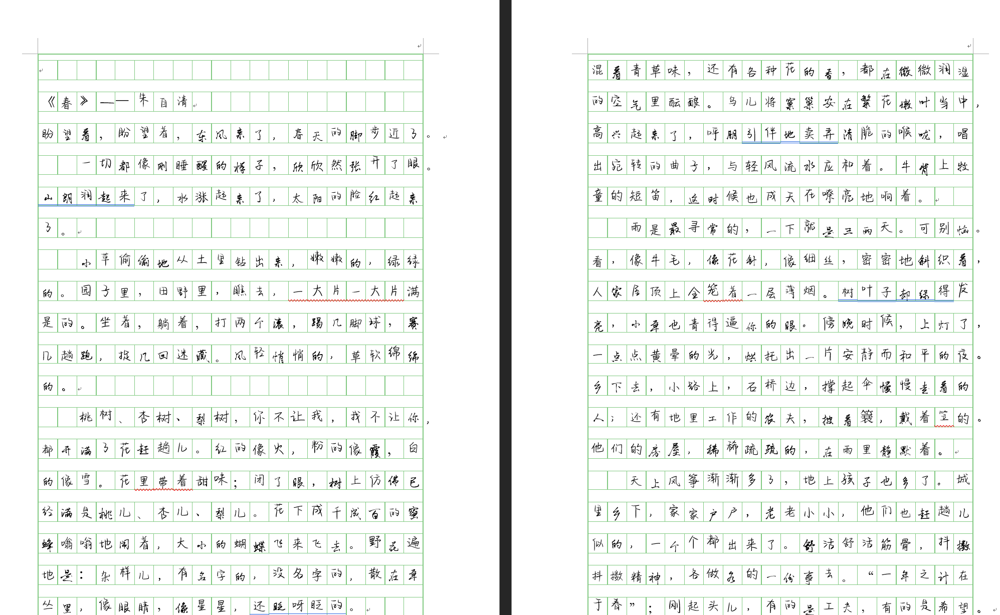

## Chinese Handwriting Tool

### 简介

随着当今社会电子化程度越来越高，我们难免会懒得自己**手动书写**一份年终感想、检讨书等等，那我们能不能有一个工具可以帮助我们自动化生成手写体文档，从而方便我们打印后上交呢？

这就是这个工具的初衷，它的特点有：

1. python自动化生成，无需手动调整word格式
2. 用户可自定义手写体
3. 用户可自定义纸张模板（本示例采用了ZJU稿纸）

### 环境要求

1. windows
2. python

### 使用指南

#### 导入字体

首先我们需要找到自己想要的手写体，可以自己去网上搜索，下载下来，或者是使用一些流行的工具生成自己的手写体风格文件。

这里我使用了这种手写体，作为示例：

导入方法为，把你下载下来的风格文件粘贴在`C:\Windows\Fonts`

然后等待导入结束，如果成功就可以在word的字体中看到

#### 编辑source.docx

这个文档的内容是手写体的源文本，你只要把想要的文字粘贴在里面即可，格式无需考虑

#### 设置template.docx

本项目使用的是ZJU稿纸（作者自己手做了一份，因为没在网上找到pdf版）

如果你有别的纸张模板，请覆盖修改这个文件。

#### 安装python库

执行`pip install pywin32`

如果安装完成，那么在当前目录中执行命令`python convert.py`

等待程序执行结束，如果看到`Process finished with exit code 0`，说明执行成功，可以去查看效果

### Q&A

1. 字体导入失败

   这个产生的原因可能是把下载的字体压缩包直接放进fonts文件夹，要注意只把ttf后缀文件放进去

2. 安装库失败

   请查看本地python环境是否已安装，已经pip是否安装到你指定的那个python环境下

### 改进

如果你对项目也感兴趣，请站内联系我，期待您的contribution！

如果你觉得项目有点用，谢谢你的⭐！